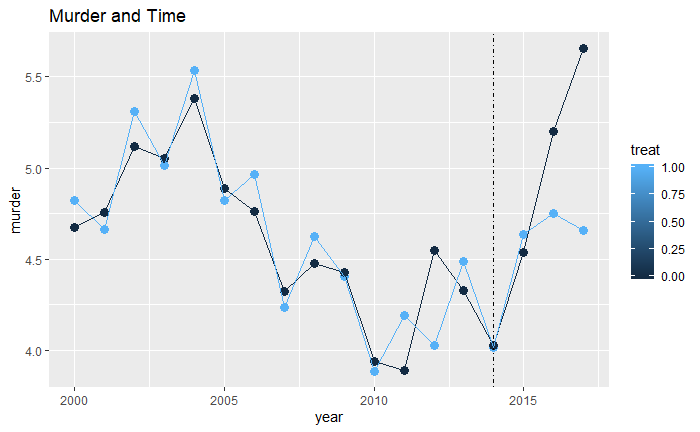

## 2X2 Difference-in-Differences

Causal inference with cross-sectional data is fundamentally tricky.

1. People, firms, etc. are different from one another in lots of ways.
2. Can only get a clean comparison when you have a (quasi-)experimental setup, such as an experiment or an regression discontinuity.

Difference-in-difference makes use of a treatment that was applied to one group at a given time but not another group. It compares how each of those groups changed over time (comparing them to themselves to eliminate between-group differences) and then compares the treatment group difference to the control group difference (both of which contain the same time gaps, eliminating differences over time).

## KEEP IN MIND

- For Difference-in-differences to work, *parallel trends* must hold. That is, *nothing else should be changing the gap between treated and control states at the same time as the treatment*. While it is not a formal test of parallel trends, researchers often look at whether the gap between treated and control states is constant in pre-treatment years.
- Suppose in $$t = 0$$ ("Pre-period"),  and $$t = 1$$ ("Post-period"). We want to estimate $$\tau = Post - Pre$$, or $$Y(post)-Y(pre)= Y(t=1)-Y(t=0)=\tau$$.

## ALSO CONSIDER

- This page discusses "2x2" difference-in-difference design, meaning there are two groups, and treatment occurs at a single point in time. Many difference-in-difference applications instead use many groups, and treatments that are implemented at different times (a "rollout" design). Traditionally these models have been estimated using fixed effects for group and time period, i.e. ["two-way" fixed effects]({{ "/Model_Estimation/OLS/fixed_effects_in_linear_regression.html" | relative_url }}). However, this approach with difference-in-difference can heavily bias results if treatment effects differ across groups, and alternate estimators are preferred. See [Goodman-Bacon 2018](https://www.nber.org/papers/w25018) and [Callaway and Sant'anna 2019](https://papers.ssrn.com/sol3/Papers.cfm?abstract_id=3148250).


# IMPLEMENTATIONS


## Python

```python

# Step 1: Load libraries and import data

# load libraries
import pandas as pd
import statsmodels.api as sm

# for certain versions of jupyter:
# %matplotlib inline

url = (
    "https://raw.githubusercontent.com/LOST-STATS/LOST-STATS"
    ".github.io/master/Model_Estimation/Data/"
    "Two_by_Two_Difference_in_Difference/did_crime.xlsx"
)

df = pd.read_excel(url)

# Step 2: indicator variables 

# whether treatment has occured at all
df['after'] = df['year'] >= 2014
# whether it has occurred to this entity
df['treatafter'] = df['after'] * df['treat']

# Step 3:

# use pandas basic built in plot functionality to get a visual
# perspective of our parallel trends assumption
ax = df.pivot(index='year', columns='treat', values='murder').plot(
    figsize=(20, 10), 
    marker='.', 
    markersize=20, 
    title='Murder and Time',
    xlabel='Year',
    ylabel='Murder Rate'
)
# the function returns a matplotlib.pyplot.Axes object 
# we can use this axis to add additional decoration to our plot
ax.axvline(x=2014, color='gray', linestyle='--') # treatment year
ax.legend(loc='upper left', title='treat', prop={'size': 20}) # move and label legend

# Step 4:

# statsmodels has two separate APIs
# the original API is more complete both in terms of functionality and
# documentation
X = sm.add_constant(df['treat', 'treatafter', 'after'].astype('float'))
y = df['murder']
sm_mod = sm.OLS(y, X).fit()

# the formula API is more familiar for R users 
# it can be accessed through alternate constructors
smff_fit = sm.OLS.from_formula('murder ~ 1 + treat + treatafter + after', data=df).fit()

# it can also be accessed through a separate namespace
import statsmodels.formula.api as smf
smf_fit = sm.ols('murder ~ 1 + treat + treatafter + after', data=df).fit()

# if using jupyter, rich output is displayed without the print function
# we should see three identical outputs
print(sm_alt_fit.summary())
print(sm_fit.summary())
print(smf_fit.summary())
```


## R

In this case, we need to discover whether legalized marijuana could change the murder rate. Some states legalized marijuana in 2014. So we measure the how the murder rate changes from before 2014 to after between legalized states and states without legalization.

Step 1:
* First of all, we need to load Data and Package, we call this data set "DiD".
```r
library(tidyverse)
library(broom)
library(here)
library(readxl)
DiD <- read_excel("https://raw.githubusercontent.com/LOST-STATS/LOST-STATS.github.io/master/Model_Estimation/Data/Two_by_Two_Difference_in_Difference/did_crime.xlsx"))
```

Step 2:

Notice that the data has already been collapsed to the treated-year level. That is, there is one observation of the murder rate for each year for the treated states (all averaged together), and one observation of the murder rate for each year for the untreated states (all averaged together).

We create the indicator variable called `after` to indicate whether it is in the treated period of being after the year of 2014 (1), or the before period of between 2000-2013 (0). The variable `treat` indicates that the state legalizes marijuana in 2014. Notice that `treat = 1` in these states even before 2014.

If the year is after 2014 **and** the state decided to legalize marijuana, the indicator variable "treatafter" is "1" .

```r
DiD <- DiD %>%
		mutate(after = year >= 2014) %>%
        mutate(treatafter = after*treat)
```

Step 3:

Then we need to plot the graph to visualize the impact of legalize marijuana on murder rate by using `ggplot`.

```r
mt <- ggplot(DiD,aes(x=year, y=murder, color = treat)) +
        geom_point(size=3)+geom_line() +
        geom_vline(xintercept=2014,lty=4) +
        labs(title="Murder and Time", x="Year", y="Murder Rate")
mt
```


It looks like, before the legalization occurred, murder rates in treated and untreated states were very similar, lending plausibility to the parallel trends assumption.

Step 4:

We need to measure the impact of impact of legalize marijuana. If we include `treat`, `after`, and `treatafter` in a regression, the coefficient on `treatafter` can be interpreted as "how much bigger was the before-after difference for the treated group?" which is the DiD estimate.

```r
reg<-lm(murder ~ treat+treatafter+after, data = DiD)
summary(reg)
```

After legalization, the murder rate dropped by 0.3% more in treated than untreated states, suggesting that legalization reduced the murder rate.
