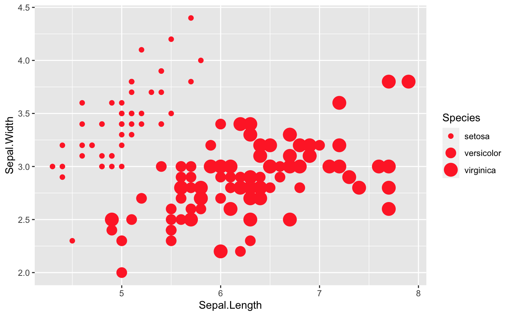
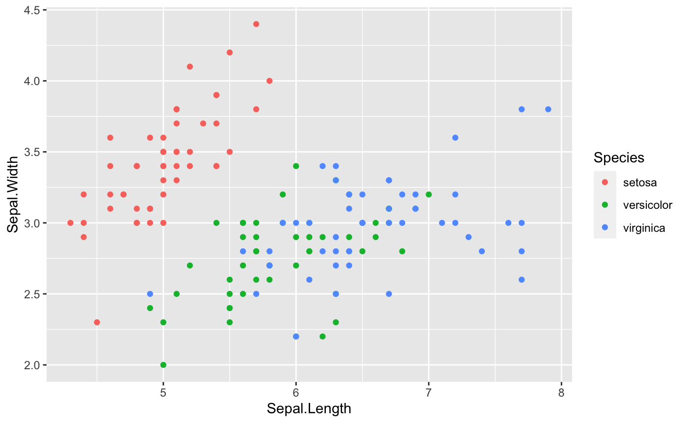
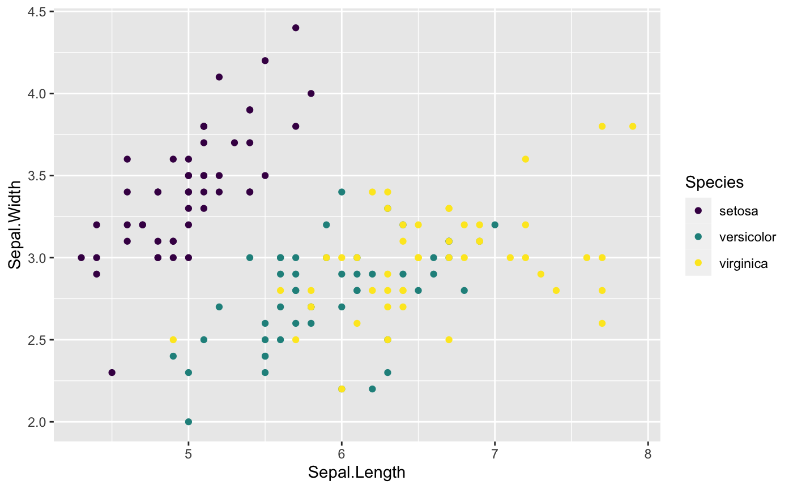
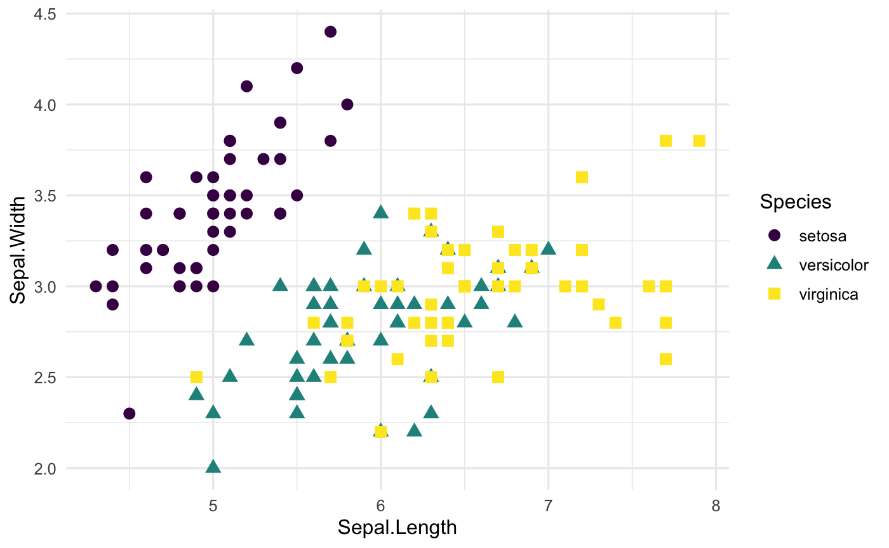
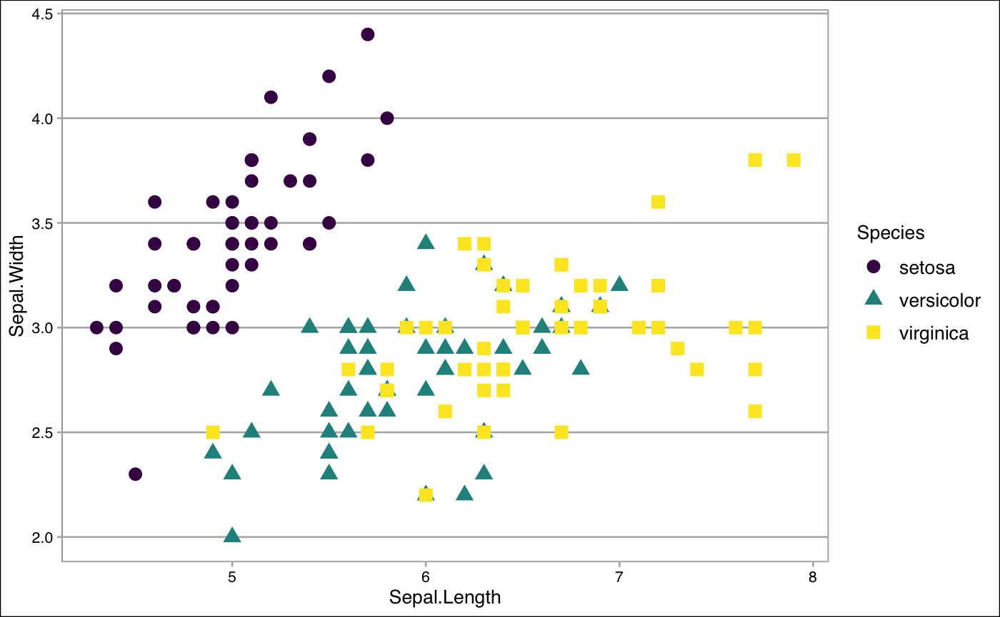
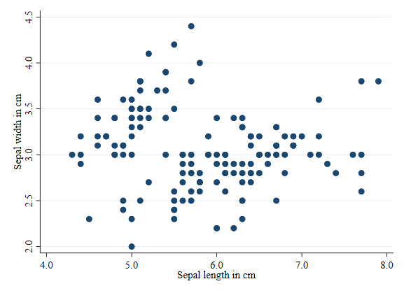
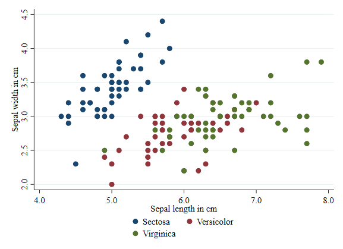
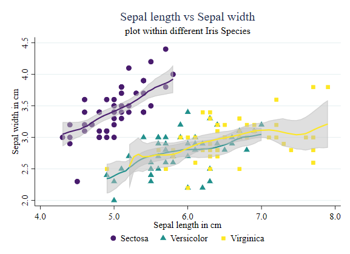

# Introduction

A scatterplot is a useful and straightforward way to visualize the relationship between two variables,eventually revealing a correlation. It is often used to make initial diagnoses before any other statistical analyses are conducted.This tutorial will not only teach you how to make scatterplots, but also explore the ways to help you design your own styling scatterplots.


## Keep in Mind


- **REMEMBER** always clean your dataset before you try to make scatterplots since in the real world, the dataset is always messier than the `iris` dataset used below. 
- Scatterplots may not work well if the variables that you are interested in are discrete, or if there are a large number of data points.
- **Be more careful** if you have **Date** (which is time-series data) as your x-variable, **Date** can be very tricky in many ways.

## Also Consider

- If one of your variables is discrete, then instead of scatterplots, you may want to check how to make bar graphs [here]({{ "/Presentation/Figures/bar_graphs.html" | relative_url }}).

Specifically in R:
- Formatting graph legends is important for styling scatterplots. So check [here](https://www.r-graph-gallery.com/239-custom-layout-legend-ggplot2.html) if you want to work with graph legends. 
- If you are working with time series visualization with **ggplot2** package, see [here](https://www.r-graph-gallery.com/279-plotting-time-series-with-ggplot2.html) for more help. 
- Check [here](https://rstudio.com/wp-content/uploads/2015/03/ggplot2-cheatsheet.pdf) for more data visualization with **ggplot2** package.


# Implementations

## R

For this R demonstration, we will introduce how to use **ggplot2** package to create nice scatterplots. 

* Before we create the scatterplots, we need to make sure that we install and library all the packages we need.
Using the function `p_load()` in the **pacman** package is able to allow us to install and library all the packages we need at once time. 

```r
if (!require("pacman")) install.packages("pacman")
pacman::p_load(ggplot2,viridis,dplyr, RColorBrewer,tidyverse,ggthemes,ggpubr)
```

### Step 1: Basic Scatterplot

Let's start with the basic scatterplot. Say we want to check the relationship between Sepal width and Sepal length of the iris species. There are a few steps to construct the scatterplot:

* Step1: specify the dataset that we want to visualize
* Step2: tell which variable to show on x and y axis 
* Step3: add a `geom_point()` in order to show the points


If you have questions about how to use `ggplot` and `aes`, check [Here]({{ "/Presentation/Figures/bar_graphs.html" | relative_url }}) for more help.

```r
ggplot(data = iris, aes(
  ## Put Sepal.Length on the x-axis, Sepal.Width on the y-axis
  x=Sepal.Length, y=Sepal.Width))+
  ## Make it a scatterplot with geom_point()
  geom_point()
```


### Step 2: Map a variable to marker feature

One of the most powerful and magic abilities of the *ggplot2* package is to map a variable to marker features. 

Notice that attributes set *outside* of `aes()` apply to *all* points (like `size=4` here), while attributes set *inside* of `aes()` set the attribute separately for the values of the variable.


#### <span style="color:orange"> **Transparency** </span>

  We can distinguish the `Species` by `alpha` (transparency). 

```r
ggplot(iris, aes(x=Sepal.Length, y=Sepal.Width, 
                 ## Where transparency comes in
                 alpha=Species)) + 
    geom_point(size =4, color="seagreen") 
```


#### <span style="color:orange"> **Shape** </span>

`shape` is also a common way to help us to see relationship between two variables within different groups. Additionally, you can always change the shape of the points. Check [here](https://www.datanovia.com/en/blog/ggplot-point-shapes-best-tips/) for more ideas. 

  
```r
ggplot(iris, aes(x=Sepal.Length, y=Sepal.Width, 
                 ## Where shape comes in
                 shape=Species)) + 
    geom_point(size = 4,color="orange") 
```


#### <span style="color:orange"> **Size** </span>

 `size` is a great option that we can take a look at as well. However, note that `size` will work better with continuous variables.

```r
ggplot(iris, aes(x=Sepal.Length, y=Sepal.Width, 
                 ## Where size comes in 
                 size=Species)) + 
    geom_point(shape = 18, color = "#FC4E07") 
```



#### <span style="color:orange"> **Color** </span>

Last but not least, let's `color` these points depends on the variable `Species` in the `iris` dataset.

```r
## First, we need to make sure that 'Species' is a factor variable 
## class(iris$Species)

## Since 'Species' is already a factor variable, we do not need to do conversion 
## However, in case 'Species' is not a factor variable, we can solve this question using as.factor() function, like below
## iris$Species <- as.factor(iris$Species)

## Then, we are ready to plot 
ggplot(data = iris, aes(x=Sepal.Length, y=Sepal.Width, 
                        ## distinguish the species by color
                        color=Species))+
  geom_point()
```


 * ##### *Note*

    * If you do not like the default colors in the ggplot2, there are a couple of ways to change that.The **RColorBrewer**package will definitely help. If you want to know more about **RColorBrewer** package,see [here](https://ggplot2.tidyverse.org/reference/scale_brewer.html). Additionally,the **viridis** package is also very helpful to change the default colors. For more information of the **viridis** package, check [here](https://cran.r-project.org/web/packages/viridis/vignettes/intro-to-viridis.html).
    * If you do not like all the options that the  **RColorBrewer** and **viridis** packages provide, see [here](http://www.sthda.com/english/wiki/ggplot2-colors-how-to-change-colors-automatically-and-manually) to work with color in the **ggplot2** package.

```r
ggplot(data = iris, aes(x=Sepal.Length, y=Sepal.Width, color=Species))+
  geom_point()+
  ## Where RColorBrewer package comes in
  scale_colour_brewer(palette = "Set1") ## There are more options available for palette

ggplot(data = iris, aes(x=Sepal.Length, y=Sepal.Width, color=Species))+
  geom_point()+
  ## Where viridis package comes in
  scale_color_viridis(discrete=TRUE,option = "D")  ## There are more options to choose
```

This first graph is using `RColorBrewer` package,and the second graph is using `viridis` package.




#### <span style="color:orange"> **Put all the options together** </span>

Of course, we can always mix `color`,`transparency`,`shape` and `size` together to get prettier plot. Simply set more than one of them in `aes()`!

### Step 3: Find the comfortable themes

The next step that we can do is to figure out what the most fittable themes to match all the hard work we have done above. 

#### <span style="color:orange"> **Themes from **ggplot2** package** </span>
  
In fact, **ggplot2** package has many cool themes available alreay such as `theme_classic()`, `theme_minimal()` and `theme_bw()`. Another famous theme is the dark theme: `theme_dark()`. Let's check out some of them. 
  
```r
ggplot(iris, aes(x=Sepal.Length, y=Sepal.Width, 
                 col=Species,
                 shape=Species)) + 
  geom_point(size=3) +
  scale_color_viridis(discrete=TRUE,option = "D") +
  theme_minimal(base_size = 12)
```




#### <span style="color:orange"> **Themes from the `ggthemes` package** </span>

`ggthemes` package is also worth to check out for working any plots (maps,time-series data, and any other plots) that you are working on. `theme_gdocs()`, `theme_tufte()`, and `theme_calc()` all work very well. See [here](https://yutannihilation.github.io/allYourFigureAreBelongToUs/ggthemes/) to get more cool themes. 

```r
ggplot(iris, aes(x=Sepal.Length, y=Sepal.Width, 
                 col=Species,
                 shape=Species)) + 
  geom_point(size=3) +
  scale_color_viridis(discrete=TRUE,option = "D") +
  ## Using the theme_tufte()
  theme_tufte()
```



#### <span style="color:orange"> **Create by your own** </span>

If you do not like themes that **ggplot2** and `ggthemes` packages have, don't worry. You can always create your own style for your themes. Check [here](https://www.datanovia.com/en/blog/ggplot-themes-gallery/) to desgin your own unique style.

### Step 4: Play with labels

It is time to label all the useful information to make the plot be clear to your audiences. 

#### <span style="color:orange"> **Basic Labelling** </span>

Both `labs()` and `ggtitle()` are great tools to deal with labelling information. In the following code, we provide the example how to use `labs()` to label the all the things that we need. Take a look [here](https://www.r-graph-gallery.com/289-control-ggplot2-title.html) if you want to learn how to use `ggtitle()`.
  

```r
ggplot(iris, aes(x=Sepal.Length, y=Sepal.Width, 
                 col=Species,
                 shape=Species)) + 
  geom_point(size=3) +
  scale_color_viridis(discrete=TRUE,option = "D") +
  theme_minimal(base_size = 12)+
  ## Where the labelling comes in 
  labs(
    ## Tell people what x and y variables are
    x="Sepal Length",
    y="Sepal Width",
    ## Title of the plot
    title = "Sepal length vs. Sepal width",
    subtitle = " plot within different Iris Species"
  )
```


#### <span style="color:orange"> **Postion and Appearance** </span>

After the basic labelling, we want to make them nicer by playing around the postion and appearance (text size, color and faces).
  
```r
ggplot(iris, aes(x=Sepal.Length, y=Sepal.Width, 
                 col=Species,
                 shape=Species)) + 
  geom_point(size=3) +
  scale_color_viridis(discrete=TRUE,option = "D") +
  labs(
    x="Sepal Length",
    y="Sepal Width",
    title = "Sepal length vs. Sepal width",
    subtitle = "plot within different Iris Species"
  )+
  theme_minimal(base_size = 12) +
  ## Change the title and subtitle position to the center 
  theme(plot.title = element_text(hjust = 0.5),
        plot.subtitle = element_text(hjust = 0.5))+
  ## Change the appearance of the title and subtitle
  theme (plot.title = element_text(color = "black", size = 14, face = "bold"),
         plot.subtitle = element_text(color = "grey40",size = 10, face = 'italic')
         )
```


### Step 5: Show some patterns

After done with step 4, you should end with a very neat and unquie plot. Let's end up with this tutorial by checking whether there are some specific patterns in our dataset. 

#### <span style="color:orange"> **Linear Trend** </span>

 According to the plot, it seems like there exists a linear relationship between sepal length and sepal width. Thus, let's add a linear trend to our scattplot to help readers see the pattern more directly using `geom_smooth()`. Note that the `method` argument in `geom_smooth()` allows to apply different smoothing method like glm, loess and more. See the [doc](https://ggplot2.tidyverse.org/reference/geom_smooth.html) for more.
  
```r
ggplot(iris, aes(x=Sepal.Length, y=Sepal.Width, 
                 col=Species,
                 shape=Species)) + 
  geom_point(size=3) +
  scale_color_viridis(discrete=TRUE,option = "D") +
  labs(
    x="Sepal Length",
    y="Sepal Width",
    title = "Sepal length vs. Sepal width",
    subtitle = "plot within different Iris Species"
  )+
  theme_minimal(base_size = 12) +
  theme(plot.title = element_text(hjust = 0.5),
        plot.subtitle = element_text(hjust = 0.5))+
  theme (plot.title = element_text(color = "black", size = 14, face = "bold"),
         plot.subtitle = element_text(color = "grey40",size = 10, face = 'italic')) +
  ## Where linear trend + confidence interval come in
  geom_smooth(method = 'lm',se=TRUE)
```


#### Congratulations!!! You just make your own style of scatterplots if you are following all the steps above and try to play around the different options. 

## Stata

For this Stata demonstration, I will use a combination of `scatter` and `twoway`, both native commands in Stata, to create all the figures trying to emulate the structure you see above in R.  

While I want to use only official commands within Stata, I will use Ben Jann's `grstyle` to set some basic graph themes, although I'll keep them minimalistic. see `help grstyle` for more options.

### Setup

To replicate all figures here, you will need to make sure you have `grstyle` installed in your computer. To make things comparable to the R example, I will also use the *Iris* dataset.

Other than that, I use the following setup:

```stata
ssc install grstyle
grstyle init
grstyle color background white
grstyle set legend , nobox
webuse iris, clear
```

### Basic Scatterplot

Let's start with the basic scatterplot. Say we want to check the relationship between Sepal width and Sepal length of the iris species. Basic scatterplots can be obtained using the command `scatter`.

The general syntax is as follows:

```stata
scatter yvar1 [yvar2 yvar3 ...] xvar, [options]
```

You can choose to use one or more variables that will be measured in the vertical axis _yvar_. The last variable _xvar_ will be used for the horizontal axis. For the example, I will plot only two variables: Sepal width and Sepal length. 

```stata
scatter sepwid seplen 
```




### Scatterplot by groups

Something you may want to do when producing Scatterplots is to visually separate different groups within the same scatterplot. For example, in the Iris data, we would like to see how sepal dimensions change by Iris type. To be able to do this, you need to use `twoway` to overlap multiple graphs together. 

There are two ways to create multiple overalping plots. The easier one is this:

```stata
twoway  scatter sepwid seplen if iris==1 || ///
        scatter sepwid seplen if iris==2 || ///
        scatter sepwid seplen if iris==3
```

Where each subplot (by iris type) is separated using *||*. The tripple forward slash *///* is used to break the line, and avoid code that is too long to follow.

The second option, my preferred option, is to separate each subplot, using parenthesis to encapsulate each subplot:

```stata
twoway  (scatter sepwid seplen if iris==1) ///
        (scatter sepwid seplen if iris==2) ///
        (scatter sepwid seplen if iris==3) 	
```

This is convenient because allows you to add and differentiate options that affect a subplot, vs options that affect the whole *twoway plot*.

One more thing. The basic plot (as above) differentiates each plot by color, but uses generic labels for each subgroup. So lets add labels for the three types of Irises.

```stata
twoway  (scatter sepwid seplen if iris==1) ///
        (scatter sepwid seplen if iris==2) ///
        (scatter sepwid seplen if iris==3), ///
        legend(order(1 "Sectosa" 2 "Versicolor" 3 "Virginica")) 
```



#### Transparency

Starting in Stata 15, it is possible to add transparency to a figure. See that this is done using the option `color()'. For fun, Im using the same color on each subgroup: "forest_green".

```stata
twoway  (scatter sepwid seplen if iris==1, color(forest_green%10)) ///
        (scatter sepwid seplen if iris==2, color(forest_green%40)) ///
        (scatter sepwid seplen if iris==3, color(forest_green%80)), ///
        legend(order(1 "Sectosa" 2 "Versicolor" 3 "Virginica")) 
```


#### Shape/symbols

In Stata, you will use the word `symbol` rather than `shape` to differentiate the markers in a scatter plot. 
`Symbols` can be modified using the option `symbol()`. To see all options for symbols, you can type `palette symbol`. 

  
```stata
twoway  (scatter sepwid seplen if iris==1, color(gold) symbol(O)) ///
        (scatter sepwid seplen if iris==2, color(gold) symbol(T)) ///
        (scatter sepwid seplen if iris==3, color(gold) symbol(S)), ///
        legend(order(1 "Sectosa" 2 "Versicolor" 3 "Virginica")) 
```


#### Size

Size of a marker can be modified using the option `size()`. See `help markersizestyle` for all available size options.

```stata
twoway  (scatter sepwid seplen if iris==1, color(red) msize(small)) ///
        (scatter sepwid seplen if iris==2, color(red) msize(medium)) ///
        (scatter sepwid seplen if iris==3, color(red) msize(large)), ///
        legend(order(1 "Sectosa" 2 "Versicolor" 3 "Virginica"))
```


#### Color

This is the first option I applied earlier. However, this is a good opportunity to point out all the color options Stata has. See `help colorstyle##colorstyle` for options. In the example below I use the RBG approach to choose colors.

```stata
twoway  (scatter sepwid seplen if iris==1, color("240 120 140") ) ///
        (scatter sepwid seplen if iris==2, color("100 190 150") ) ///
        (scatter sepwid seplen if iris==3, color("125 190 230") ), ///
        legend(order(1 "Sectosa" 2 "Versicolor" 3 "Virginica")) 
```

 
### Labels, Titles and Subtitles

I mentioned this earlier. Stata uses a variable label for the plot axis titles. However, you can modify that using the options `xtitle()` and `ytitle()`. 

It is also possible to add a title and subtitle to the figure, using options `title()` and `subtitle()`

```stata
twoway  (scatter sepwid seplen if iris==1, color("72 27 109") symbol(O)) ///
        (scatter sepwid seplen if iris==2, color("33 144 140") symbol(T)) ///
        (scatter sepwid seplen if iris==3, color("253 231 37") symbol(s)), ///
        legend(order(1 "Sectosa" 2 "Versicolor" 3 "Virginica") col(3)) ///
		    title(Sepal length vs Sepal width) subtitle(plot within different Iris Species)	
```


### Showing some patterns

Something else you may want to do is add bivarite fitted lines to emphasize particular relationships within pairs of variables. You can do this by adding additional subplots that will produce this information.

In the example below, I add linear fitted values for all cases. I make sure to use the same line color, so they are consistent with the scatter plot.
  
```stata
twoway  (scatter sepwid seplen if iris==1, color("72 27 109") symbol(O)) ///
        (scatter sepwid seplen if iris==2, color("33 144 140") symbol(T)) ///
        (scatter sepwid seplen if iris==3, color("253 231 37") symbol(s)) ///
		    (lfitci sepwid seplen if iris==1, clcolor("72 27 109") clwidth(0.5)  acolor(%50) ) ///
        (lfitci sepwid seplen if iris==2, clcolor("33 144 140") clwidth(0.5)  acolor(%50) ) ///
        (lfitci sepwid seplen if iris==3, clcolor("253 231 37") clwidth(0.5)  acolor(%50) ), ///
        legend(order(1 "Sectosa" 2 "Versicolor" 3 "Virginica") col(3)) ///
		    title(Sepal length vs Sepal width) subtitle(plot within different Iris Species)	///
		    xtitle(Sepal length in cm) ytitle(Sepal width in cm)
```


Of course, you can be more sophisticated, and use a local polynomial to identify those relationships:

```stata
twoway  (scatter sepwid seplen if iris==1, color("72 27 109") symbol(O)) ///
        (scatter sepwid seplen if iris==2, color("33 144 140") symbol(T)) ///
        (scatter sepwid seplen if iris==3, color("253 231 37") symbol(s)) ///
		    (lpolyci sepwid seplen if iris==1, clcolor("72 27 109") clwidth(0.5)  acolor(%50) ) ///
        (lpolyci sepwid seplen if iris==2, clcolor("33 144 140") clwidth(0.5)  acolor(%50) ) ///
        (lpolyci sepwid seplen if iris==3, clcolor("253 231 37") clwidth(0.5)  acolor(%50) ), ///
        legend(order(1 "Sectosa" 2 "Versicolor" 3 "Virginica") col(3)) ///
		    title(Sepal length vs Sepal width) subtitle(plot within different Iris Species) ///
		    xtitle(Sepal length in cm) ytitle(Sepal width in cm)
```



And done. You can use the above guide to modify your plots as needed. 
