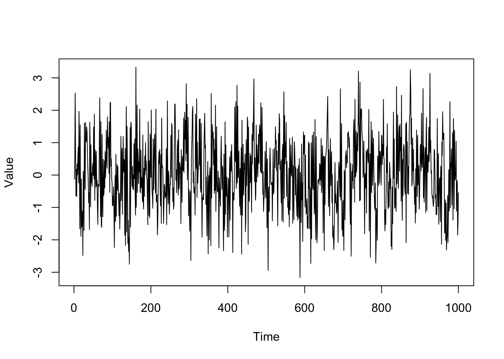

# Moving Average (MA) Models

Moving Average Models are a common method for modeling linear processes that exhibit serial correlation. This can take many forms, but an easy example is weather patterns.

Imagine we modelled Ski Lift Purchases over a 5 consecutive weekday period. Let weather shocks be identically and independently distributed. A weather shock with large amounts of snow would cause more individuals to go ski. This shock would have future impacts on ski ticket purchases; individuals tomorrow will go skiing due
to the snowfall today. This means when we think of the process, we should account for previous shock effects on outcomes today:

$$
SkiTicketPurchases_t = \mu + \theta_1*Weather_t + \theta_2*Weather_{t-1}
$$

## Definition

Let $$\epsilon_t \sim N(0, \sigma^2_{\epsilon})$$. A moving average
process, which is denoted MA(q), take the form as:

$$
y_t = \mu + \epsilon_t + \theta_1 \epsilon_{t-1} + ... + \theta_q \epsilon_{t-q}
$$

Note that a MA(q) process has *q lagged $$\epsilon$$ terms*. Thus a MA(1)
process would take the form:

$$
y_t = \mu + \epsilon_t + \theta_1 \epsilon_{t-1}
$$

## Properties of a MA(1) process:

1. The mean is constant.

$$
E(y_t) = E(\mu + \epsilon_t + \theta_1 \epsilon_{t-1}) = \mu
$$

2. The variance is constant.

$$
Var(y_t) = Var(\mu + \epsilon_t + \theta_1 \epsilon_{t-1}) = (1 + \theta_1^2) * \sigma^2_{\epsilon}  $$

3. The covariance between $$y_t$$ and $$y_{t-q}$$ is decreasing as $$q \to \infty$$.

$$
Cov(y_t, y_{t-1}) = E(y_t*y_{t-1}) - E(y_t)E(y_{t-1}) \\
    = E([\mu + \epsilon_t + \theta_1 \epsilon_{t-1}] [\mu + \epsilon_{t-1} + \theta_1 \epsilon_{t-2}]) - \mu^2 \\
    = \mu^2 + \theta_1 \sigma_{\epsilon}^2 -\mu^2 \\
    = \theta_1 \sigma_{\epsilon}^2
$$

$$
Cov(y_t, y_{t-2}) = E(y_t*y_{t-2}) - E(y_t)E(y_{t-2}) \\
= E([\mu + \epsilon_t + \theta_1 \epsilon_{t-1}] [\mu + \epsilon_{t-2} + \theta_1 \epsilon_{t-3}]) - \mu^2 \\
= \mu^2 -\mu^2 \\
= 0
$$

Additional helpful information can be found at [Wikipedia: Moving Average Models](https://en.wikipedia.org/wiki/Moving-average_model)

## Keep in Mind

- Time series data needs to be properly formatted (e.g. date columns should be formatted into a time)
- Model Selection uses the Akaike Information Criterion (AIC), Bayesian Information Criterion (BIC), or the Akaike Information Criterion corrected (AICc) to determine the appropriate number of terms to include. Refer to [Wikipedia:Model Selection](https://en.wikipedia.org/wiki/Model_selection#Criteria) for further information.

# Implementations

## Julia

MA(q) models in Julia can be estimated using the StateSpaceModels.jl package, which also allows for the estimation of a variety of time series models that have linear state-space representations. 

Begin by importing and loading necessary packages into your work environment. 

```julia
# Load necessary packages
using StateSpaceModels, CSV, Dates, DataFrames, LinearAlgebra
```

You can then download the `GDPC1.csv` dataset using the CSV.jl package, and store it as a `DataFrame` object. 

```julia 
# Import (download) data 
data = CSV.read(download("https://github.com/LOST-STATS/lost-stats.github.io/raw/source/Time_Series/Data/GDPC1.csv"), DataFrame)
```

The data can then be assigned a general ARIMA(p,d,q) representation, where if `p` and `d` are set to zero, the model specification becomes MA(q). The `p`=`d`= 0 constraint can be applied by inputting `order = (0,0,q)`, where `q`>0. 

```julia 
# Specify GDPC1 series as an MA(2) model
model = SARIMA(data.GDPC1, order = (0,0,2))
```

Lastly, the above-specified model can be estimated using the `fit!` function, and the estimation results printed using the `results` function. The sole input for both of these functions is the `model` object that contains the chosen data series and its assigned ARIMA structure. 

```julia
# Fit (estimate) the model
fit!(model)

# Print estimates
results(model)
```

## R

```r
#in the stats package we can simulate an ARIMA Model. ARIMA stands for Auto-Regressive Integrated Moving Average model. We will be setting the AR and I parts to 0 and only simulating a MA(q) model.
set.seed(123)
DT = arima.sim(n = 1000, model = list(ma = c(0.1, 0.3, 0.5)))

plot(DT, ylab = "Value")
```



```r
set.seed(123)
DT = arima.sim(n = 1000, model = list(ma = c(0.1, 0.3, 0.5)))

#ACF stands for Autocorrelation Function
#Here we can see that there may be potential for 3 lags in our MA process. (Note: This is due to property (3): the covariance of y_t and y_{t-3} is nonzero while the covariance of y_t and y_{t-4} is 0)
acf(DT, type = "covariance")
```


```r
set.seed(123)
DT = arima.sim(n = 1000, model = list(ma = c(0.1, 0.3, 0.5)))

#Here I'm estimating an ARIMA(0,0,3) model which is a MA(3) model. Changing c(0,0,q) allows us to estimate a MA(q) process.
arima(x = DT, order = c(0,0,3))

    ##
    ## Call:
    ## arima(x = DT, order = c(0, 0, 3))
    ##
    ## Coefficients:
    ##          ma1     ma2     ma3  intercept
    ##       0.0722  0.2807  0.4781     0.0265
    ## s.e.  0.0278  0.0255  0.0294     0.0573
    ##
    ## sigma^2 estimated as 0.9825:  log likelihood = -1410.63,  aic = 2831.25

#We can also estimate a MA(7) model and see that the ma4, ma5, ma6, and ma7 are close to 0 and insignificant.
arima(x = DT, order = c(0,0,7))


    ##
    ## Call:
    ## arima(x = DT, order = c(0, 0, 7))
    ##
    ## Coefficients:
    ##          ma1     ma2     ma3      ma4      ma5      ma6      ma7  intercept
    ##       0.0714  0.2694  0.4607  -0.0119  -0.0380  -0.0256  -0.0219     0.0267
    ## s.e.  0.0316  0.0321  0.0324   0.0363   0.0339   0.0332   0.0328     0.0533
    ##
    ## sigma^2 estimated as 0.9806:  log likelihood = -1409.65,  aic = 2837.3

#fable is a package designed to estimate ARIMA models. We can use it to estimate our MA(3) model.
library(fable)
#an extension of tidyverse to temporal data (this allows us to create time series data into tibbles which are needed for fable functionality)
library(tsibble)
#visit https://dplyr.tidyverse.org/ to understand dplyr syntax; this package is important for fable functionality
library(dplyr)

#When using the fable package, we need to convert our object into a tsibble (a time series tibble). This gives us a data frame with values and an index for the time periods
DT = DT %>%
  as_tsibble()

head(DT)

    ## # A tsibble: 6 x 2 [1]
    ##   index  value
    ##   <dbl>  <dbl>
    ## 1     1 -0.123
    ## 2     2  0.489
    ## 3     3  2.53
    ## 4     4  0.706
    ## 5     5 -0.640
    ## 6     6  0.182

#Now we can use the dplyr package to pipe our dataset and create a fitted model
#Note: the ARIMA function in the fable package uses an information criterion for model selection; these can be set as shown below; additional information is above in the Keep in Mind section (the default criterion is aicc)
MAfit = DT %>%
  model(arima = ARIMA(value, ic = "aicc"))

#report() is needed to view our model
report(MAfit)

    ## Series: value
    ## Model: ARIMA(0,0,3)
    ##
    ## Coefficients:
    ##          ma1     ma2     ma3
    ##       0.0723  0.2808  0.4782
    ## s.e.  0.0278  0.0255  0.0294
    ##
    ## sigma^2 estimated as 0.9857:  log likelihood=-1410.73
    ## AIC=2829.47   AICc=2829.51   BIC=2849.1

#if instead we want to specify the model manually, we need to specify it. For MA models, set the pdq(0,0,q) term to the MA(q) order you want to estimate. For example: Estimating a MA(7) would mean that I should put pdq(0,0,7). Additionally, you can add a constant if wanted; this is shown below

#with constant
MAfit = DT %>%
  model(arima = ARIMA(value ~ 1 + pdq(0,0,3), ic = "aicc"))

report(MAfit)

    ## Series: value
    ## Model: ARIMA(0,0,3) w/ mean
    ##
    ## Coefficients:
    ##          ma1     ma2     ma3  constant
    ##       0.0722  0.2807  0.4781    0.0265
    ## s.e.  0.0278  0.0255  0.0294    0.0573
    ##
    ## sigma^2 estimated as 0.9865:  log likelihood=-1410.63
    ## AIC=2831.25   AICc=2831.31   BIC=2855.79

#without constant
MAfit = DT %>%
  model(arima = ARIMA(value ~ 0 + pdq(0,0,3), ic = "aicc"))

report(MAfit)

    ## Series: value
    ## Model: ARIMA(0,0,3)
    ##
    ## Coefficients:
    ##          ma1     ma2     ma3
    ##       0.0723  0.2808  0.4782
    ## s.e.  0.0278  0.0255  0.0294
    ##
    ## sigma^2 estimated as 0.9857:  log likelihood=-1410.73
    ## AIC=2829.47   AICc=2829.51   BIC=2849.1

#A faster, more compact way to write a code would be as follows:

#Automatic estimation
DT %>%
  as_tsibble() %>%
  model(arima = ARIMA(value)) %>%
  report()

    ## Series: value
    ## Model: ARIMA(0,0,3)
    ##
    ## Coefficients:
    ##          ma1     ma2     ma3
    ##       0.0723  0.2808  0.4782
    ## s.e.  0.0278  0.0255  0.0294
    ##
    ## sigma^2 estimated as 0.9857:  log likelihood=-1410.73
    ## AIC=2829.47   AICc=2829.51   BIC=2849.1

#Manual estimation
DT %>%
  as_tsibble() %>%
  model(arima = ARIMA(value ~ 0 + pdq(0, 0, 3))) %>%
  report()

    ## Series: value
    ## Model: ARIMA(0,0,3)
    ##
    ## Coefficients:
    ##          ma1     ma2     ma3
    ##       0.0723  0.2808  0.4782
    ## s.e.  0.0278  0.0255  0.0294
    ##
    ## sigma^2 estimated as 0.9857:  log likelihood=-1410.73
    ## AIC=2829.47   AICc=2829.51   BIC=2849.1
```
